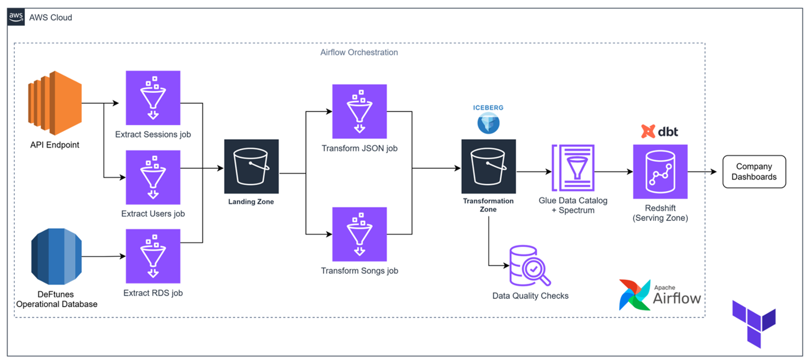

# DeFtunes Data Pipeline: ETL, Data Modeling, Quality, and Orchestration

## Project Overview

This project implements a robust and scalable data pipeline for DeFtunes, a music streaming company that has expanded into digital song purchases. The pipeline is designed to extract transactional data from various sources, transform it into a clean and usable format, model it for analytical purposes, ensure data quality, and orchestrate the entire process for daily, incremental updates.

The architecture follows a **medallion architecture** (Landing, Transformation, and Serving zones) to ensure data reliability and accessibility.

## Architecture Diagram

The data pipeline leverages a comprehensive set of AWS services and open-source tools:

**Part 1: ETL and Data Modeling**


**Part 2: Data Quality and Orchestration**


## Key Features

* **Multi-Source Data Ingestion**: Extracts data from an operational PostgreSQL database (songs) and a new purchase API (users and sessions).
* **Medallion Architecture**: Implements a three-tier data lake approach (Landing, Transformation, Serving) using Amazon S3 for storage.
* **Data Transformation with AWS Glue**: Utilizes AWS Glue ETL jobs for data extraction, cleansing, and transformation.
* **Apache Iceberg Integration**: Stores transformed data in the Transformation Zone using Apache Iceberg format for efficient querying and schema evolution.
* **Data Warehousing with Amazon Redshift**: Leverages Redshift as the Serving Layer for analytical workloads.
* **Redshift Spectrum**: Enables Redshift to query Iceberg tables directly from S3, avoiding data loading.
* **Data Modeling with dbt (data build tool)**: Defines and builds a star schema in the Redshift Serving Layer for optimized analytics.
* **Incremental Data Loading**: Designed to handle daily incremental ingestion of new data.
* **Orchestration with Apache Airflow**: Automates and schedules the entire data pipeline using Airflow DAGs, ensuring timely and reliable data delivery.
* **Data Quality Checks with AWS Glue Data Quality**: Implements data quality rules on the transformed data to ensure accuracy and consistency.
* **Analytical Views**: Creates materialized views on top of the star schema to answer specific business questions (e.g., sales per artist, sales per country).
* **Data Visualization (Optional)**: Integration with Apache Superset for creating dashboards and visualizing key insights.

## Data Sources

1.  **DeFtunes Operational RDS (PostgreSQL)**: Contains comprehensive information about available songs (`songs` table), based on the Million Song Dataset.
2.  **DeFtunes Purchase API**: Provides transactional data for song purchases, including `users` and `sessions` endpoints. This API includes details about user sessions, purchased songs within a session, and user demographics.

## Technologies Used

* **Cloud Provider**: Amazon Web Services (AWS)
    * **Storage**: Amazon S3 (Data Lake)
    * **ETL**: AWS Glue (ETL Jobs, Glue Data Catalog, Glue Data Quality)
    * **Infrastructure as Code**: Terraform
    * **Data Warehousing**: Amazon Redshift
    * **Relational Database**: Amazon RDS (PostgreSQL)
* **Orchestration**: Apache Airflow
* **Data Modeling**: dbt (data build tool)
* **Data Lake Format**: Apache Iceberg
* **Data Visualization**: Apache Superset (for optional dashboarding)
* **Programming Languages**: Python, SQL
* **Libraries**: `pandas`, `requests`, `json`, `psycopg2`

## Project Structure

The repository is organized as follows:

.
├── dags/                          # Apache Airflow DAGs for orchestration
│   ├── deftunes_api_pipeline.py
│   └── deftunes_songs_pipeline.py
├── dbt_modeling/                  # dbt project for data modeling
│   ├── models/
│   │   ├── bi_views/              # Analytical views
│   │   └── serving_layer/         # Star schema models
│   └── dbt_project.yml
├── images/                        # Diagrams and screenshots
├── scripts/                       # Helper scripts (e.g., setup, airflow restart)
├── terraform/                     # Terraform configurations for AWS infrastructure
│   ├── assets/
│   │   ├── extract_jobs/          # Python scripts for Glue extraction jobs
│   │   └── transform_jobs/        # Python scripts for Glue transformation jobs
│   ├── modules/
│   │   ├── data_quality/
│   │   ├── extract_job/
│   │   ├── serving/
│   │   └── transform_job/
│   ├── main.tf
│   └── outputs.tf
└── README.md                      # This README file


## Setup and Deployment

This project utilizes Terraform for infrastructure provisioning, ensuring reproducibility and version control of the AWS resources.

### Prerequisites

* AWS Account with appropriate permissions.
* Terraform installed.
* AWS CLI configured.
* Python and `pip` installed.
* `dbt` installed.
* `jq` installed (for parsing CLI outputs).

### Deployment Steps (High-Level)

1.  **Environment Setup**:
    * Run `source scripts/setup.sh` to configure the environment.
    * Obtain AWS Console URL and necessary endpoints (RDS, API, Redshift) from CloudFormation outputs.
2.  **AWS Glue ETL Jobs (Landing Zone)**:
    * Complete the Python scripts in `terraform/assets/extract_jobs/`.
    * Configure Terraform module `terraform/modules/extract_job/glue.tf`.
    * Upload Glue scripts to the designated S3 bucket.
    * Navigate to the `terraform/` directory and run:
        ```bash
        cd terraform
        terraform init
        terraform plan
        terraform apply -target=module.extract_job
        ```
    * Execute the Glue extraction jobs (`de-c4w4a1-api-users-extract-job`, `de-c4w4a1-api-sessions-extract-job`, `de-c4w4a1-rds-extract-job`) via AWS CLI to populate the landing zone.
3.  **AWS Glue Transformation Jobs (Transformation Zone)**:
    * Complete the Python scripts in `terraform/assets/transform_jobs/`.
    * Configure Terraform module `terraform/modules/transform_job/glue.tf`.
    * Upload Glue scripts to the designated S3 bucket.
    * Apply the Terraform module:
        ```bash
        terraform apply -target=module.transform_job
        ```
    * Execute the Glue transformation jobs (`de-c4w4a1-json-transform-job`, `de-c4w4a1-songs-transform-job`) via AWS CLI to populate the transformation zone with Iceberg tables.
4.  **Redshift Setup (Serving Zone)**:
    * Configure IAM roles and Redshift cluster settings in `terraform/modules/serving/iam.tf` and `terraform/modules/serving/redshift.tf`.
    * Apply the Terraform module:
        ```bash
        terraform apply -target=module.serving
        ```
    * Verify Redshift connection and external schemas (e.g., `deftunes_transform`) using SQL queries.
5.  **dbt Data Modeling**:
    * Initialize a dbt project: `dbt init dbt_modeling`.
    * Configure `profiles.yml` to connect to the Redshift cluster (using `dev` database, `deftunes_serving` schema).
    * Test dbt connection: `cd dbt_modeling && dbt debug`.
    * Define star schema models in `dbt_modeling/models/serving_layer/` and analytical views in `dbt_modeling/models/bi_views/`.
    * Update `dbt_modeling/dbt_project.yml` to include the new models and their materialization strategies.
    * Upload dbt project files to the designated S3 bucket for Airflow.
    * Run dbt models: `dbt run -s serving_layer`.
6.  **AWS Glue Data Quality**:
    * Define data quality rulesets in `terraform/modules/data_quality/glue.tf` for `sessions` and `users` tables.
    * Apply the Terraform module: `terraform apply -target=module.data_quality`.
7.  **Apache Airflow Orchestration**:
    * Access the Airflow UI using the `AirflowDNS` output from CloudFormation (default credentials: `airflow`/`airflow`).
    * Configure DAGs (`deftunes_songs_pipeline.py`, `deftunes_api_pipeline.py`) by replacing placeholders with actual bucket names, Glue roles, and API endpoints.
    * Upload DAG files to the Airflow DAGs S3 bucket.
    * Unpause the DAGs in the Airflow UI to initiate the pipeline runs, including backfilling for historical data.

## Data Quality Implementation

AWS Glue Data Quality is integrated into the pipeline to ensure the reliability of the transformed data. Rule sets are defined using Data Quality Definition Language (DQDL) for tables in the `deftunes_transform` schema. Examples of rules include:

* `IsComplete "column_name"`: Checks for non-null values.
* `ColumnLength "column_name" = X`: Validates column length.
* `Uniqueness "column_name" > 0.95`: Ensures a high percentage of unique values.
* `ColumnValues "column_name" <= X`: Checks values against a condition.

These checks are executed as part of the Airflow DAGs, providing immediate feedback on data quality.

## Orchestration with Apache Airflow

Two main DAGs orchestrate the data pipeline:

1.  **`deftunes_songs_pipeline_dag`**: Handles the ETL process for songs data from the RDS source. It includes tasks for:
    * Extracting data using a Glue job.
    * Transforming data into Iceberg format using another Glue job.
    * Performing data quality checks on the transformed songs data.
    * Running dbt models to load data into the serving layer.
2.  **`deftunes_api_pipeline_dag`**: Manages the ETL process for users and sessions data from the API source. It includes tasks for:
    * Extracting users data using a Glue job.
    * Extracting sessions data using a Glue job.
    * Transforming the JSON data into Iceberg format using a dedicated Glue job.
    * Performing data quality checks on both users and sessions data.
    * Running dbt models to load data into the serving layer.

Both DAGs are configured for incremental data loading and include robust error handling and monitoring capabilities through Airflow's UI.

## Data Modeling with dbt

The dbt project `dbt_modeling` is responsible for transforming the raw data in the `deftunes_transform` (silver) schema into a star schema within the `deftunes_serving` (gold) schema in Redshift.

The star schema typically consists of:

* **Fact Tables**: E.g., `fact_session` (containing measures like price and foreign keys to dimension tables).
* **Dimension Tables**: E.g., `dim_artists`, `dim_users`, `dim_songs` (containing descriptive attributes).

Additionally, `bi_views` are created as analytical views on top of the star schema, such as `sales_per_artist_vw` and `sales_per_country_vw`, to facilitate business intelligence and reporting.
